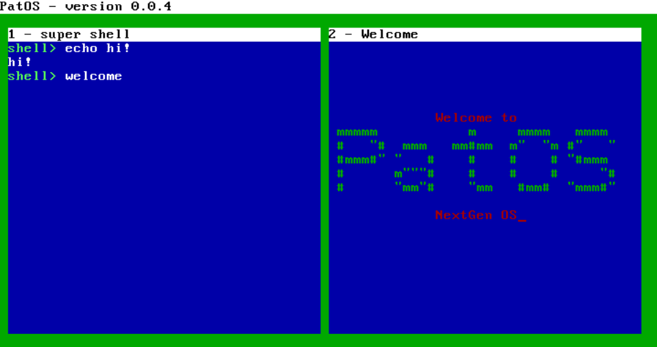
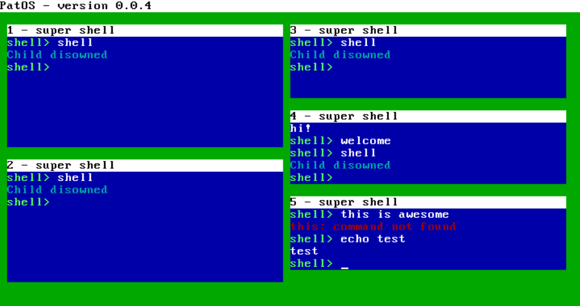

PatOS - Graphical Interface and Tiling Window Manager
=============================================

# Screenshots

The welcome program

Five way window split

### Main Features
* Dynamic Tiling Window Manager
  * Secure window abstraction
  * Support for up to 6 windows 
  * Arbitrary focus selection
  * Dynamic window addinga and removing
  * Automatic output history
  * Automatic window cleanup
  * Automatic Scrolling and resizing
* VGA Output support
* Full keyboard driver
* User library (libwin)
  * Request window
  * Get window size
  * Clear window
  * 16-Color support

### Extra Features
* Dual output driver
* Backspace support
* Upgraded shell
* Welcome program

# Window Manager

The dynamic tiling window manager (dtwm) is tasked with managing the resource
of windows, and abstracting away the positioning and actions on all the windows
as a whole.  It provides abstractions to add windows and remove windows. It is
backed by a map from process ids to Window objects, where it stores the windows
that are currently open. In addition to the window map, it keeps of track of
what the current layout is.

## Window

Manages the screen resources and creates abstractions for writing to the screen
and moving the cursor around. The window stores metadata such as the title,
size, location, and position. It also handles resizing and scrolling of the
contents of the window. This is powered by a backing TextBuffer. The window is what
makes the drawing calls to the VGA driver.

Windows are considered to be a per-process resource, with the exception that
children will share their parent's window unless they request their own.
Although they share it, the children cannot close the parent's window.

### TextBuffer

Stores the characters and metadata in a buffer that's twice as big as the
biggest window possible (80x25). It provides abstractions for writing to the
buffer, as well as accessing data within the buffer, especially  accessing data
relative to the window size (eg: getting the correct 10 lines after the
resized to a height of 10).

## Layouts

Layouts are used to store window positions and sizes within the screen. This is
backing feature behind the dynamic tiling window manager. Layouts are stored as
an array of arrays of Layouts (`Layout***`). The array stores the specified
array of layouts for a given number of windows. For example the layout array
for 1 contains a single layout which dictates that the window should take up
the whole screen (minus borders and the top OS line) and be positioned at the
top left. Likewise, the layout for two windows specifies that there should be
two windows, with full height, but half of the width, one positioned on the
left and the other on the right. In order to facilitate the math required to
calculate the specific widths, heights, and positions I created abstractions
for the constructor a Layout object.  The constructor takes the number of
vertical and horizontal splits, and the position of the window within those
splits.  So a 1 window layout would have 1 vertical, 1 horizontal splits, and
the 1st window vertically and horizontally.  However, a two window layout would
have two horizontal splits, 1 vertical splits.  Adding a window brings the
window manager to the next layout array, and removing a window brings it to the
previous layout array. Whenever switching to a new layout, the window manager will
resize, rescroll, and redraw all the windows.

The layouts I designed are as follows

1 window

    +---------------+
    |               |
    |               |
    |               |
    |               |
    |               |
    +---------------+

2 windows

    +-------+-------+
    |       |       |
    |       |       |
    |       |       |
    |       |       |
    |       |       |
    +-------+-------+

3 windows

    +-------+-------+
    |       |       |
    |       |       |
    |       +-------+
    |       |       |
    |       |       |
    +-------+-------+

4 windows

    +-------+-------+
    |       |       |
    |       |       |
    +-------+-------+
    |       |       |
    |       |       |
    +-------+-------+

5 windows

    +-------+-------+
    |       |       |
    |       +-------|
    +-------|       |
    |       +-------|
    |       |       |
    +-------+-------+

6 windows

    +-------+-------+
    |       |       |
    +-------+-------|
    |       |       |
    +-------+-------|
    |       |       |
    +-------+-------+

## Focus

With the ability to have more than one window (and program) running on the
screen at once, we had to introduce the concept of focus. Focus represents the
currently running window, in other words the window that gets to print things
to the screen and gets the input from the keyboard. This is extremely crucial
because without out all windows would "fight" for the keyboard input and
potentially also draw thigns wrong on the screen. In order to solve this
problem, I added a focus event to every window. Whenever a program tries to get
input, the process will first wait on the focus event. That way, if the window
has focus, it can continue to get input from the keyboard while all other
processes wait. This is also a good solution because it meant that programs
that don't require input from the keyboard can continue running without focus.

The rules of focus are:
1. The program can run until it requires input without focus
2. Forking and executing a program that uses a window gives up your focus
3. Whenever a process with a window exits focus is given to the first window
4. Focus can be preempted by the user

To implement the fourth rule I mapped the Function keys (F1-F6) to switch focus
to their corresponding windows.  So pressing F1 switches focus to the first
window, etc... This gives the user control over where the input goes.  In order
to inform the user of how to focus on windows, the window number is displayed
with the title.  Switching focus to a non-existant window does nothing.

Focus is represented with the blinking cursor on the screen. Switching focus to
a given window will move the cursor to the correct position within that window
(where it last was before the window lost focus).

## Keyboard Driver

In order to compliment the support for the VGA, I also implemented a full
keyboard driver, with support for all alphanumeric characters, as well as
punctuation and extra characters. Finally I also added support for the function
keys which serve as a way of selecting which window has focus.

## Libwin - User Library 

In order to expose all the features of my window manager and graphical support
to user programs, I created libwin, an accompany user library. Distributed as a
header file and assembly implementation, it allows user programs to interact
with the window system.

The list of system calls is as follows:

`win_req(const char* name)`

Request a window with the specified name

`win_color(int color)`

Set the foreground color for subsequent text (16 bit color code)

`win_cursor(int r, int c)`

Draw the cursor

`win_clear()`

Clear your window

`win_height()`

Get your window height

`win_width()`

Get your window width

### Upgraded Shell

As an example of how easy it is to incorporate the window system into existing
user-level applications, I demonstrated an upgraded version of our shell. By
calling `win_req("shell")` at the start of main, the system will create a
window for the shell and automatically route all outcoming characters to the
correct window. Including the headers and adding that line are the only
modifications required to fully support the window system. However, I also
added colored output using the `win_color` system call, to differentiate
between the shell prompt, user input, informational output, and errors.
Additionally, I modified the shell to spawn and disown additional shells as
well as added the ability to exit a shell.

### Welcome Program

As another example of the versatility of the user library and window program I
wrote another demo program which uses the `win_req` and `win_color` system calls
to draw a welcome message to screen

### Clear program

In order to demonstrate the `win_height` syscall, I also wrote a simple clear
program that gets the current window size and prints that number of new lines
to clear the current shell.
